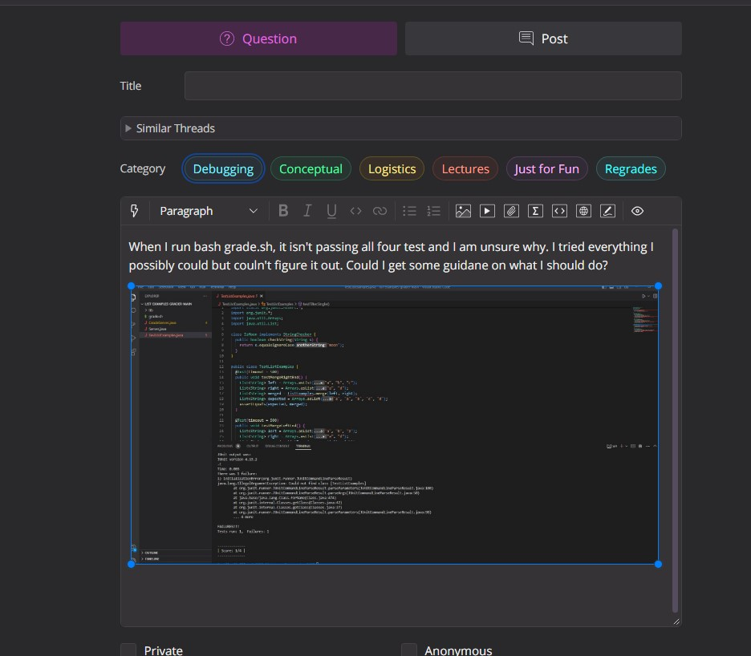
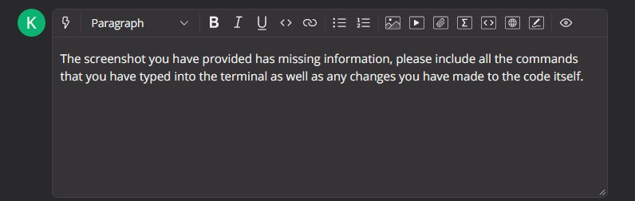
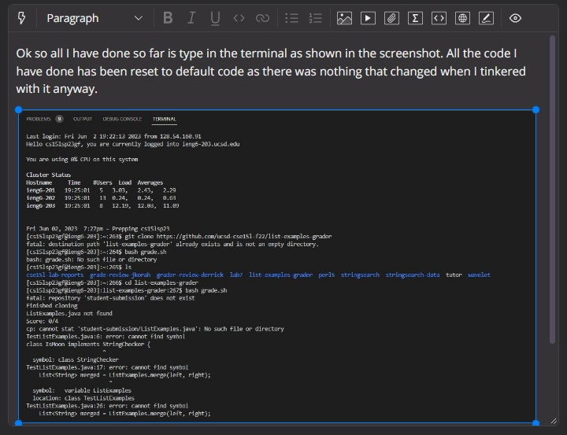
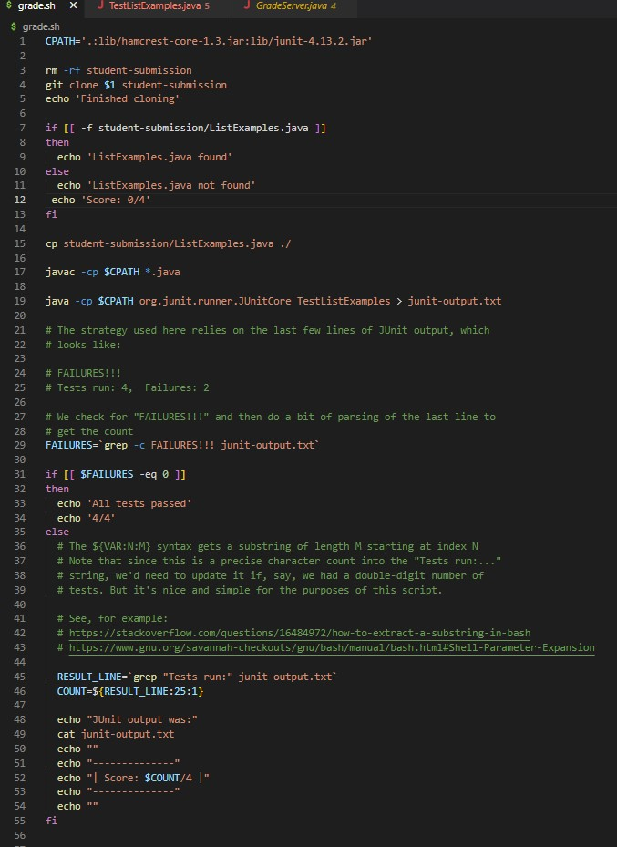
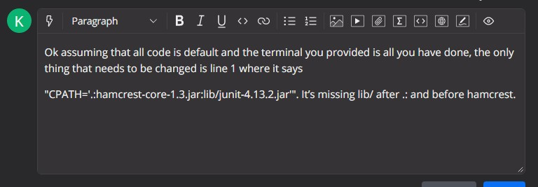

# Lab Report 5
---
## Part 1:

Original post:

TA repsonse:

Student response to TA:

(only file that needed to be edited, all the other files were default)

TA final response that solves the issue:

## Part 2: 
When it was first introduced, I had no idea what vimm was or how it was useful. Since then I have learned how to use it much more efficiently and have come to realize its usefulness outside of lab for coding in general. I found it extremely intriguing how the tutorial to use Vimm made it easy to learn the basics and kept my interest throughout by allowing me to participate in learning exercises rather than simply forcing me to read text. Although it may seem somewhat small, I really enjoyed learning about vimm.

